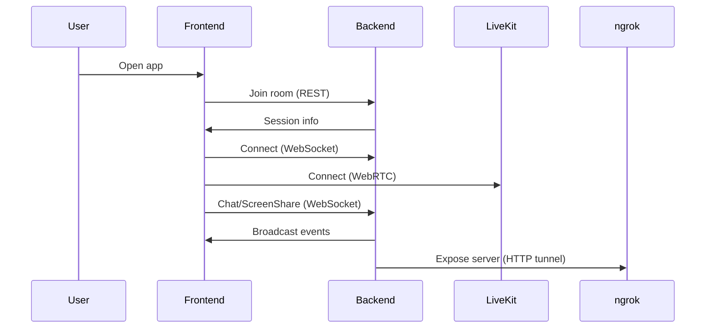

# ARCHITECTURE.md

## Overview

The `video-conf-app` is a web-based video conferencing solution with a modular architecture, consisting of a Node.js backend and a React frontend. It supports real-time video, audio, chat, screen sharing, and participant management. The app can be exposed to the internet using services like ngrok.

---

## High-Level System Diagram

```mermaid
graph TD
    A[User Browser] -- HTTP/WebSocket --> B[Frontend (React)]
    B -- REST API/WebSocket --> C[Backend (Node.js)]
    C -- External API --> D[Third-party Services (e.g., LiveKit, ngrok)]
```

---

## Main Components & Responsibilities

### Backend (`backend/`)
- **server.js**: Entry point; sets up Express server, API routes, and WebSocket for real-time communication.
- **package.json**: Declares dependencies (Express, WebSocket, etc.).
- **Responsibilities**:
  - User authentication and session management.
  - Room creation, joining, and participant tracking.
  - Signaling for video/audio streams (via WebSocket).
  - Chat message relay.
  - Integration with third-party services (e.g., LiveKit for media, ngrok for tunneling).

### Frontend (`frontend/`)
- **src/**
  - **App.jsx**: Root component; manages routing and global context.
  - **config.js**: Configuration (API endpoints, keys).
  - **index.js**: Entry point; renders the app.
  - **context/VideoConferenceContext.jsx**: Provides global state (room, participants, media).
  - **hooks/useScreenShares.js**: Custom hook for screen sharing logic.
  - **providers/LiveKitAdapter.js**: Handles LiveKit integration for media streams.
  - **components/**:
    - **ChatPanel.jsx**: Chat UI and logic.
    - **Controls.jsx**: Mute, camera, screen share, leave controls.
    - **ParticipantList.jsx**: Displays participants.
    - **PreJoinModal.jsx**: Pre-join settings (name, devices).
    - **ShareMenu.jsx**: Screen sharing options.
    - **VideoGrid.jsx**: Video layout for participants.
    - **WaitingRoomPanel.jsx**: Waiting room management.
  - **pages/**:
    - **LobbyPage.jsx**: Room selection and join.
    - **MeetingPage.jsx**: Main conference UI.
    - **WaitingPage.jsx**: Waiting room UI.
  - **styles/**: CSS for all components.

---

## Data Flow

1. **User Access**
   - User opens the app in a browser.
   - Frontend loads and presents lobby or pre-join modal.

2. **Room Join**
   - User submits join request (name, room).
   - Frontend sends REST API call to backend.
   - Backend authenticates and responds with room/session info.

3. **Media & Signaling**
   - Frontend connects to backend via WebSocket for signaling.
   - Media streams (video/audio) are managed via LiveKitAdapter and sent to LiveKit server.
   - Backend relays signaling messages and manages participant state.

4. **Chat & Screen Share**
   - Chat messages and screen share events are sent via WebSocket to backend.
   - Backend broadcasts to all participants in the room.

5. **Participant Management**
   - Backend tracks participants, updates frontend via WebSocket.
   - Frontend updates UI (ParticipantList, VideoGrid).

---

## Communication Between Frontend and Backend

- **REST API**: Used for initial room join, authentication, and configuration.
- **WebSocket**: Used for real-time signaling (media, chat, participant events).
- **LiveKit**: Frontend communicates directly with LiveKit for media streams; backend may facilitate token generation and room management.

---

## Third-Party Services

- **LiveKit**: Provides scalable real-time video/audio infrastructure.
  - Used via `LiveKitAdapter.js` in frontend.
  - Backend may handle token generation and room setup.
- **ngrok**: Used to expose local backend server to the internet for testing/demo.
  - Typically started via `launch_videoconf.sh` or `start.sh`.
  - Provides a public URL for external access.

---

## Summary Table

| Component         | Responsibility                          | Communication         | Third-Party |
|-------------------|-----------------------------------------|-----------------------|-------------|
| Backend           | Auth, room mgmt, signaling, chat relay  | REST, WebSocket       | LiveKit, ngrok |
| Frontend          | UI, media, chat, participant mgmt       | REST, WebSocket, LiveKit | LiveKit |
| LiveKit           | Media streaming                         | WebRTC/LiveKit SDK    | Yes         |
| ngrok             | Tunneling backend                       | HTTP                  | Yes         |

---

## Example Sequence

1. User opens app → LobbyPage.
2. User joins room → PreJoinModal → REST API call.
3. Backend authenticates → returns session info.
4. Frontend connects WebSocket → backend.
5. Frontend connects to LiveKit → media streams.
6. Chat, screen share, participant events → WebSocket.
7. Backend relays events → all participants.

---

## Extensibility

- Add new features (polls, reactions) via new components and backend endpoints.
- Swap LiveKit for another media service by updating `LiveKitAdapter.js` and backend integration.
- Secure backend with OAuth or JWT.

---

## Diagram (Mermaid)



---

## File Structure Reference

- `backend/server.js`: Main backend logic.
- `frontend/src/App.jsx`: Main frontend logic.
- `frontend/src/providers/LiveKitAdapter.js`: Media integration.
- `frontend/src/components/`: UI components.
- `frontend/src/context/VideoConferenceContext.jsx`: Global state.

---

## Conclusion

The `video-conf-app` is a modular, scalable video conferencing solution leveraging modern web technologies and third-party services for real-time communication. Its architecture supports extensibility and easy integration with external APIs.

---

